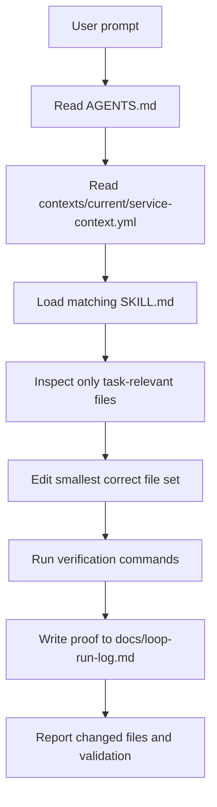

# Agentic Workspace Loop

This repo uses a lightweight loop-engineering pattern for local coding-agent
work. The loop is human-started and verification-focused.

## Required Loop Inputs

- `AGENTS.md` for default repo behavior.
- `contexts/current/service-context.yml` for current service/ticket state.
- `skills/microservice-change/SKILL.md` for microservice/API/test workflow.
- `loop-budget.md` for local machine context and output-token budgets.
- `STATE.md` for the active validation slice.

## Stop Condition

Stop only when the requested change is complete, verification has run or a
blocker is recorded, and the log identifies the context files, edited files, and
validation result.
