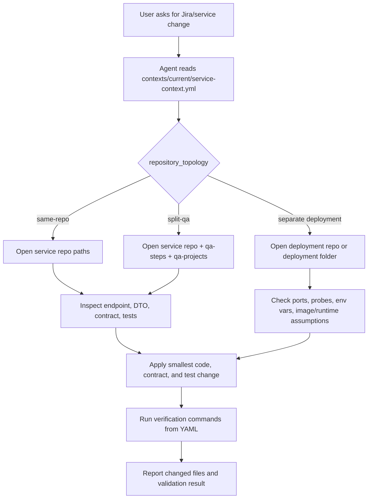
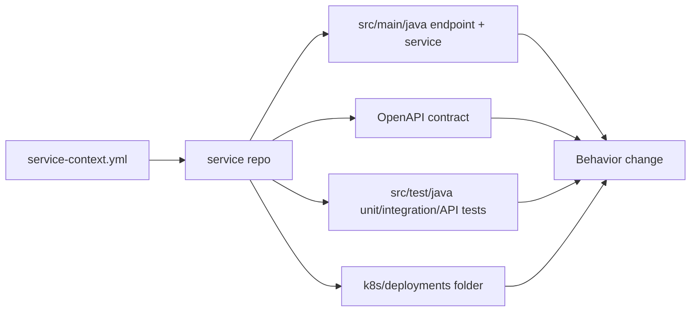
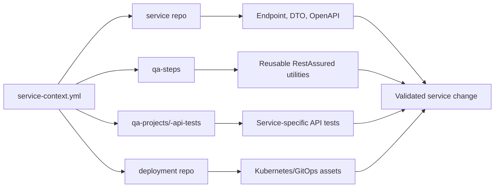
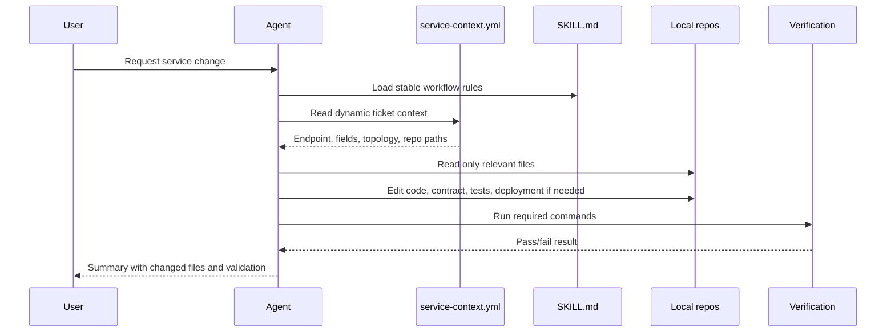

# Agentic Workflow Diagrams

These diagrams describe how the workspace guides a local coding agent without
forcing the whole repository corpus into the prompt.

## Context Routing

## Same-Repo Topology

Use this when the team owns endpoint code, contract, tests, and deployment
assets in one repository.

## Split-QA / GitOps Topology

Use this when shared QA utilities or deployment manifests are maintained outside
the service repository.

## Context Efficiency Loop

The efficiency claim is simple: keep the YAML and skills small, then let the
agent open files only after the task context points to them.

